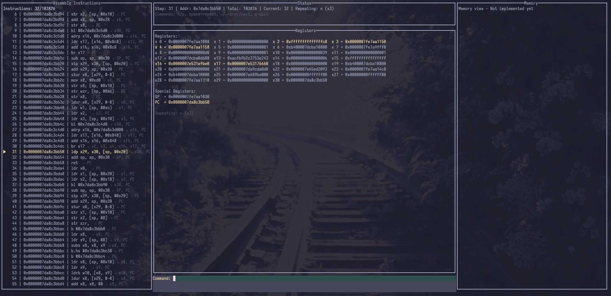

# TraceParse

> 用 trace 假装自己在调试  
> 一个“看起来像 GDB，但其实不是”的指令执行可视化工具

## 为什么会有这个项目？

直接看 trace 文件，本质上是在**硬看日志**：

- 指令是顺序的，但人的注意力不是
- 寄存器在变，但变化埋在几百行文本里
- 大脑被迫承担“状态回放器”的工作

而真正好用的调试体验，是 **“我在一个时间轴上走”**：

- 当前执行到哪条指令
- 这一步 **到底改了什么**
- 如果我后退一步，会发生什么

但很多场景下你 **并不能真的 attach 一个调试器**：

- trace 是离线的
- 目标程序已经跑完
- 或者你只拿到了执行日志

**TraceParse 的目标很简单：**

> 把“纯文本 trace”，包装成一种  
> **“看起来像在单步调试”的体验**

它不是调试器，也不试图成为调试器。

---

## 这是什么？不是什麼？

### ✅ 是什么

- 一个 **trace 解析器**
- 一个 **伪 GDB 风格的 TUI**
- 一个 **时间轴 + 状态变化** 的可视化工具
- 适合看：
  - ARM64 执行 trace
  - VM / VMP trace
  - 反混淆、反虚拟机过程中的执行日志

### ❌ 不是什么

- ❌ 不是真调试器（不能断点、不能 attach）
- ❌ 不执行指令（不做语义仿真）
- ❌ 不保证“程序正确性”

你可以把它理解成：

> **“给 trace 加了一个人类友好的外壳”**

---

## 效果预览

目标效果（GDB 风格）：


当前实现：



---

## 核心特性（当前已实现）

- **指令时间轴**
  - 逐条“前进 / 后退”
  - 高亮当前指令
- **寄存器状态视图**
  - 只强调“发生变化的寄存器”
  - 降低无关噪音
- **交互式 TUI**
  - 键盘驱动，而不是翻日志
- **自动步进模式**
  - 模拟“程序在跑”的感觉所有行为都围绕一个核心：  
    **“让我更容易看懂发生了什么”**

---

## 计划中（但不保证一定做）

- 内存视图（只展示“被访问的区域”）
- 跳转指令的可视化提示
- trace 过滤 / 折叠
- 更接近 GDB dashboard 的布局

---

## 安装与运行

### 构建

```bash
git clone https://github.com/yourusername/TraceParse.git
cd TraceParse
go build -o traceparse main.go
```

运行

```bash
./traceparse -f your_trace.log
```

不指定文件会加载示例数据

## 使用方式

界面分为三块：

- **左侧**：指令时间轴（当前指令高亮）
- **中间**：寄存器状态（变化高亮）
- **右侧**：状态信息 & 命令输入

## 常用命令

| 命令         | 说明           |
| ------------ | -------------- |
| `n` / `next` | 前进一步       |
| `p` / `prev` | 后退一步       |
| `space`      | 重复上一次命令 |

### 运行控制

| 命令   | 说明     |
| ------ | -------- |
| `run`  | 自动步进 |
| `stop` | 停止     |
| `q`    | 退出     |

## 适合谁？

如果你：

- 觉得 **“硬看 trace 是反人类的”**
- 经常在逆向 / VM / 执行日志里迷路
- 想要一种 **“时间轴式理解程序行为”** 的方式

那这个工具大概率能帮到你。

## 最后

这是一个**工程师为了让自己不那么痛苦**而写的工具。
它不会假装自己很通用，也不会假装自己很完美。

如果你也有类似的痛点——
那它的存在就已经值回票价了。
